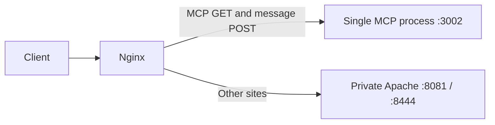

# Website and MCP reliability

This server uses Nginx for public IPv4/IPv6 HTTP and TLS. Legacy MCP SSE routes go directly to the single MCP process on `127.0.0.1:3002`. Other website routes retain their existing Apache behavior behind loopback HTTP `8081` and HTTPS `8444`.



The original outage exhausted Apache's 150 workers with persistent MCP streams. This routing removes those streams from that worker pool. It preserves existing API authentication, WSGI, static-site rules and WebSocket handling on Apache.

## Application protections

- `backend/mcp_stream_limit.py` admits at most 40 streams globally and 20 per client by default, immediately returning an overload response at capacity. Message POSTs remain outside the stream allowance. Settings validate positive limits and per-client <= global.
- `backend/mcp_transport.py` preserves legacy GET `/mcp` and POST `/mcp/messages/`, the endpoint event, UUID session query, 15-second heartbeats, tool generation, initialization, metadata and message format. Session closure removes its writer and closes all memory streams, including cancellation and send failure. Accepted HTTP messages enqueue within five seconds before returning 202; expired sessions return 404 and invalid JSON/UTF-8 returns 400.
- Before request logging buffers MCP POSTs, the body guard enforces a 1 MiB byte ceiling, a 10-second total receive deadline and 32 concurrent POST requests. Slots remain held until the inner ASGI request completes. CORS wraps overload/error responses.
- Existing query deadlines and request-rate policies remain in place. Tools and provider selection were not changed.

These are conservative operating limits, not a capacity benchmark. Application counters are per process; Nginx stream limits use shared zones. The POST allowance does not bound tool tasks and request metadata retained after HTTP 202. Initialized idle clients can occupy the stream allowance; strong fairness/account quotas require a separate policy. Future authentication configuration must explicitly wire transport dependencies and any OAuth setup.

## Server configuration snapshots

The adjacent files are the reviewed configuration for this existing host, not a generic unattended installer:

- `nginx.conf`: actual public routing/TLS configuration; MCP bypasses Apache and incoming forwarding headers are overwritten. Existing upload behavior is retained on other routes. Public HTTP serves ACME challenges from `/var/www/letsencrypt`.
- `apache-ports.conf` and `apache-frontend.conf`: private listeners and trusted forwarding. Existing Apache virtual hosts must also use the private ports, retain explicit public canonical addresses, and deny the former MCP fallback. Private virtual-host files are intentionally kept in protected server backups because some contain credentials.
- `nginx-restart.conf`: install as `/etc/systemd/system/nginx.service.d/website-reliability.conf`; restart the master on failure after five seconds. Run `systemctl daemon-reload` after installing the drop-in.
- `50-reload-website-servers`: the Certbot deploy hook validates both servers before reloading either. It uses this host's `/bin/systemctl` path.

Nginx allows 300 seconds for retiring worker generations. Persistent clients must reconnect when a generation is retired. Installing this setting does not retroactively change workers started without it. The migration used a targeted MCP restart to close their upstreams and let them drain normally. **Do not kill individual Nginx workers:** isolated testing showed that forced worker exit can leave stale shared connection-limit counters. Normal upstream closure and configured shutdown timeouts preserve/reuse those counters.

HTTP/2 is deliberately deferred: Apache's existing Upgrade advertisement caused protocol errors in rehearsal. HTTP/1.1 and WebSocket forwarding remain supported.

All eight existing certificate renewal configurations use webroot without an Apache installer. They passed Certbot staging reconfiguration tests without changing live certificate hashes. Keep the root-owned hook executable and `snap.certbot.renew.timer` enabled. If changing ingress ownership again, migrate renewal settings with it; do not restore public Apache routing while leaving mismatched renewal ownership.

## Local availability monitoring

The Python scripts are in `scripts/website_reliability`. The monitor runs as the existing nonroot `merwanroudane` user, using the installed backend Python environment. Install root-owned snapshots of all three runtime scripts under `/usr/local/lib/smatecondata-website-monitor`, plus the adjacent service and timer under `/etc/systemd/system`. Then run `systemctl daemon-reload` and enable/start `smatecondata-website-monitor.timer`.

The timer starts a check five minutes after the preceding run finishes. It does not overlap runs or create GitHub workflows. The service restricts writes to its state directory and kills the entire probe control group if its 300-second deadline is exceeded.

Each run checks:

1. All 20 configured hostnames over HTTP/HTTPS and IPv4/IPv6: 80 bounded probes with four curl jobs at a time. Curl ignores user configuration and proxies, verifies TLS, permits only HTTPS redirects, and requires the expected canonical hostname.
2. One public MCP session: initialization, tool discovery (`query_data`) and closure. Scheduled checks invoke no data tool or paid query.
3. Both local backend health endpoints, requiring HTTP 200 and JSON `status: "ok"`.

Results are atomically written to `/var/lib/smatecondata-website-monitor/latest.json`, with timestamps and explicit `HEALTHY`, `DEGRADED` or `FAILED` final status. `RUNNING` indicates an incomplete check. Only the known `app.hansearch.com` and `agent.hansearch.com` HTTP 503 outcomes count as known degradation; TLS/transport failures or changed failure statuses are unexpected failures. Recovery to 200 is healthy. New failures exit nonzero and appear in the local journal.

```bash
systemctl status smatecondata-website-monitor.timer
journalctl -u smatecondata-website-monitor.service --since today
/opt/smatecondata/backend/.venv/bin/python /usr/local/lib/smatecondata-website-monitor/monitor.py --status --output /var/lib/smatecondata-website-monitor/latest.json
```

The status command rejects incomplete, contradictory or older-than-ten-minute results. Monitoring originates on this server and provides local detection, not external outage notifications. It does not certify authenticated user workflows, every WebSocket client or economic-query correctness.

## Verification and remaining work

The repair passed 78 transport/admission/rate/wiring tests, including the installed SDK's tool execution, request metadata forwarding, cancellation, session churn, malformed payloads, bounded enqueue and request-body behavior. Isolated Nginx tests covered shared limits across reloads, URI variants, counter reuse and automatic master recovery. Public checks verified TLS/aliases, authentication denial, legacy SDK behavior, malformed-message 400, expired-session 404, oversized-body 413, CORS and zero Apache MCP upstream connections. A real public World Bank query matched the official provider response.

Run the focused backend tests from `backend/` with the installed environment:

```bash
env -i PATH=/usr/local/bin:/usr/bin:/bin PYTHONPATH="$(dirname "$PWD")" NODE_ENV=test OPENROUTER_API_KEY=test-only-key JWT_SECRET=test-only-secret DISABLE_MCP=1 DISABLE_BACKGROUND_JOBS=1 ENABLE_METADATA_LOADING=false SMATECONDATA_EMBED_FIXTURES=replay SMATECONDATA_SELECTOR_FIXTURES=replay .venv/bin/python -m pytest --noconftest tests/test_mcp_transport.py tests/test_mcp_stream_limit.py tests/test_mcp_rate_limit_middleware.py tests/test_mcp_stream_wiring.py -q
```

Two separate application endpoints remain unavailable: port 8080's saved SSH origin refuses connections, while port 7788 has no identified project/startup service. Restore the intended origin/project before replacing these 503 responses. API streaming, Jupyter and n8n still share Apache workers; migrating them directly requires preserving their authentication and WebSocket behavior. CPU, memory and host availability remain shared.

Before deploying or rolling back future changes, preserve current configurations, review differences, validate both servers, test the actual public MCP session, and verify renewal ownership. The server's protected recovery directory contains exact original configurations and hashes; credentials, private backups and unrelated working-tree changes are not published here.
